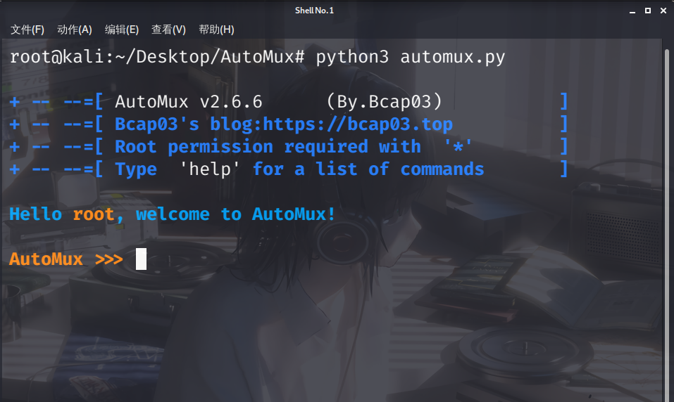

# AutoMux
本工具是为了懒人更便捷的配置Termux所写.

## 截图

### 依赖
• Python 3.x

##### 手动安装方法:

**如果觉得Github速度慢，可以使用国内码云链接**

https://gitee.com/whitedays2007/automux

git clone https://github.com/whitedays2007/automux $PREFIX/share/   
   
**Linux的直接把$PREFIX换成/usr/share/**  
**因为时间有限没时间多写脚本了请原谅**   

cd $PREFIX/share/AutoMux

chmod +x Module/*

cd Module/

然后ls看一下就会有两个shell文件

**Termux.sh是只对termux的一键配置到环境的执行脚本**

__Linux.sh是只对Debian(包括Ubuntu Kali)一键配置到环境的执行脚本__

直接在环境中启动 automux

### 联系我
**Bilibili: @Windows-8**

** 符号提示 **

黄色的 ! 代表这个工具某些功能受root权限的影响    

红色的 * 代表这这个工具需要root权限

蓝色的 LINUX 代表这只能给基于Debian的Linux使用

